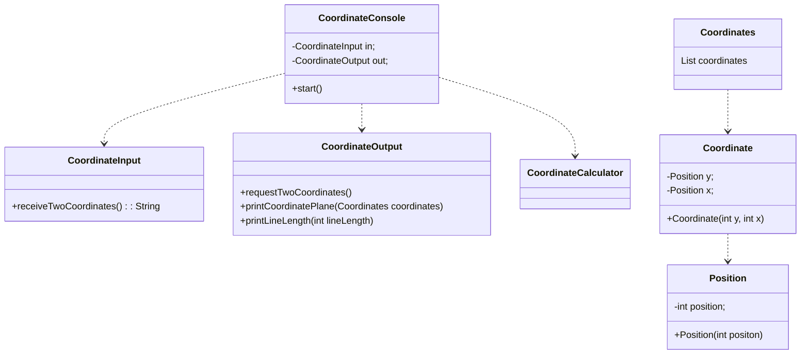

# 좌표계산기

## 클래스 다이어그램

```mermaid
classDiagram
    class CoordinateConsole {
        -CoordinateInput in;
        -CoordinateOutput out;

        +start()
    }

    CoordinateConsole ..> CoordinateInput
    class CoordinateInput {
        +receiveTwoCoordinates(): String
    }

    CoordinateConsole ..> CoordinateOutput
    class CoordinateOutput {
        +requestTwoCoordinates()
        +printCoordinatePlane(Coordinates coordinates)
        +printLineLength(int lineLength)
    }

    CoordinateConsole ..> CoordinateCalculator
    class Coordinates {
        List coordinates
    }

    Coordinates ..> Coordinate
    class Coordinate {
        -Position y;
        -Position x;

        +Coordinate(int y, int x)
    }

    Coordinate ..> Position
    class Position {
        -int position;
        
        +Position(int positon)
    }
```

## 기능 요구사항

### 선 길이
- [x] 점의 좌표는 0~24만 입력 가능하다
- [ ] 두 점 사이의 거리를 구한다
- [ ] 두 점의 위치를 확인할 수 있는 좌표평면을 String 형태로 만든다
- [ ] 사용자의 입력을 받아 출력하는 좌표계산기를 완성한다 